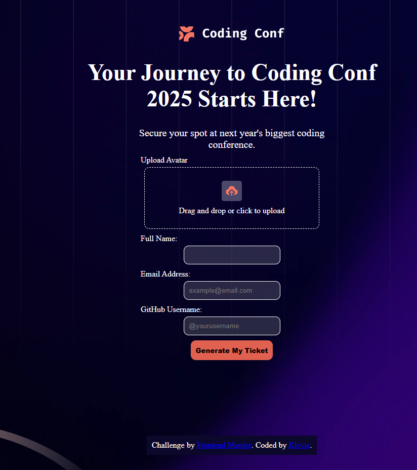
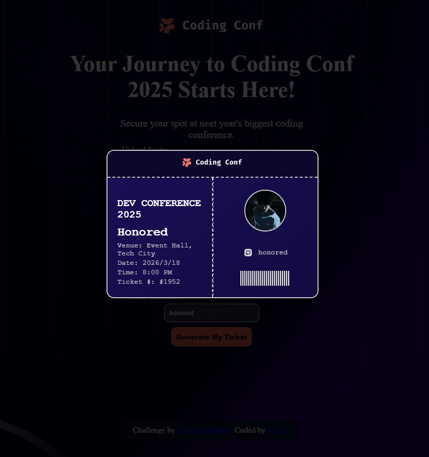

🎟️ Conference Ticket Generator

A responsive Conference Ticket Generator built as part of a Frontend Mentor challenge.
The project allows users to fill out a form and generate a personalized conference ticket dynamically.

🚀 Features

- User input form (name, email, etc.)
- Form validation (required fields + email format)
- Avatar upload (image preview)
- Dynamic ticket generation after submission
- Drag & drop file upload (optional feature)
- Responsive layout (mobile → desktop)
- Interactive UI with hover/focus states

| Technology             | Purpose                           |
| ---------------------- | --------------------------------- |
| **HTML5**              | Semantic structure                |
| **CSS3**               | Styling and layout                |
| **JavaScript**         | Form handling & ticket generation |
| **Flexbox / CSS Grid** | Layout alignment                  |
| **GitHub Pages**       | Deployment                        |

📸 Preview

Page View

Ticket 

